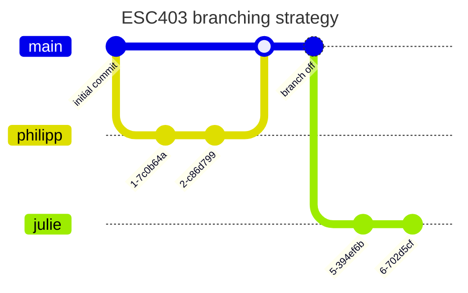

# Predicting Bicycle Traffic in Zurich


- **University** : University of Zurich
- **Lecture**: ESC 403 Introduction to Data Science


## Authors
- Julie Tschanz
- Philipp Wyss (philippchristian.wyss@uzh.ch)
- Damian Brülhart
- Mike Krähenbühl


## Project Proposal

Where do I find the project proposal?
```yaml
📁 esc403
┗━📁 doc 
  ┗━📁 01_proposal
    ┗━📜 proposal_traffic_zurich.pdf # see here
```

## Project Presentation

Where do I find the final project presentation?
```yaml
📁 esc403
┗━📁 doc 
  ┗━📁 02_presentation # reproducable 🎉 Quarto presentation
```


## Data Sources
- [Stadt Zurich](https://stadt-zurich.ch/)
- [opendata.swiss](https://opendata.swiss/en) (Swiss Open Government data)


## Project Structure
General project structure is derived by "Good enough practices in scientific computing" - G. Wilson et al.
```yml
📁 my_project
|--📁 doc  # text associated documents
|--📁 data  # raw data and metadata
|--📁 results # files generated during cleanup and analysis
|--📁 src # project source code / functions / reports / dashboards
|--📁 bin # external scripts or compiled programs
```

## Branching Strategy (Git)

1. Develop in your personal "development" branch
2. Merge to main when ready and tested


