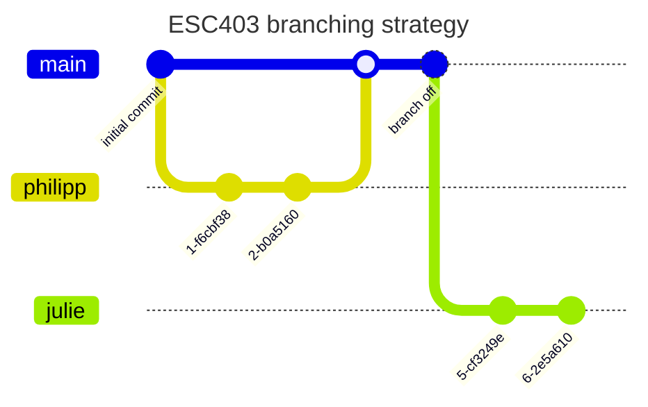

# Predicting Bicycle Traffic in Zurich

> [!NOTE]
> This project repository was part of a data science project at University of Zurich in 2024. It's content is now archived.


<br>Image Source: [www.zuerich.com](https://www.zuerich.com/de/besuchen/unterwegs-in-zuerich/fahrradverleih-in-zuerich)

A data science project for the following lecture:

- **University** : University of Zurich
- **Lecture**: ESC 403 Introduction to Data Science

Methods used for predicting bicycle traffic in Zurich City:

- Random Forest (Python)
- Linear Regression (R)
- Lasso Regression (R)
- Poisson Regression (R)
- Negative Binomial Regression (R)


## Authors
- Julie Tschanz
- Philipp Wyss (philippchristian.wyss@uzh.ch)
- Damian Brülhart
- Mike Krähenbühl


## Project Proposal

Where do I find the project proposal?
```yaml
📁 esc403
┗━📁 doc 
  ┗━📁 01_proposal
    ┗━📜 proposal_traffic_zurich.pdf # see here
```

## Project Presentation

Where do I find the final project presentation?
```yaml
📁 esc403
┗━📁 doc 
  ┗━📁 02_presentation # reproducable 🎉 Quarto presentation
```


## Data Sources
- [Stadt Zurich](https://stadt-zurich.ch/)
- [opendata.swiss](https://opendata.swiss/en) (Swiss Open Government data)

**What about data preperation?**

We have created a seperate data preperation notebook for each year. That happens there:

1. Load raw data from `📁 data` folder or directly from source
2. Aggregate data on hourly basis
3. Imputation of missing values
4. Joining of different datasets
5. Export as `.csv` to `📁 results` folder
```yaml
📁 esc403
┗━📁 src 
  ┣━📜 data_preparation_2019.ipynb
  ┣━📜 data_preparation_2020.ipynb
  ┣━📜 data_preparation_2021.ipynb
  ┣━📜 data_preparation_2022.ipynb
  ┗━📜 data_preparation_2023.ipynb
```

## General Project Structure
General project structure is derived by "Good enough practices in scientific computing" - G. Wilson et al.
```yml
📁 my_project
|--📁 doc  # text associated documents and final hand-in's
|--📁 data  # raw data files
|--📁 results # files generated during cleanup and analysis
|--📁 src # project source code / functions / reports / dashboards
|--📁 bin # external scripts or compiled programs
```

## Branching Strategy (Git)

1. Develop in your personal "development" branch
2. Merge to main when ready and tested


