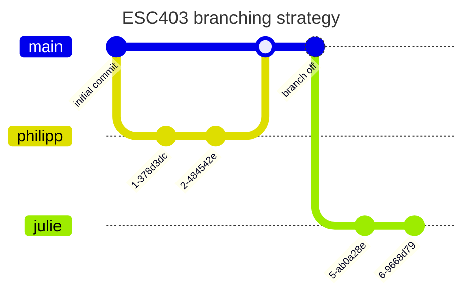

# esc403
ESC 403 Data Science Project Repository

## Project Members
- Julie Tschanz
- Philipp Wyss
- Damian Brühlhaart
- Mike Krähenbühl


## Project Proposal
tbd

### Where to Find Potential Datasets?
- [UC Irvine Machine Learning Repository](https://archive.ics.uci.edu/)
- [Hugging Face](https://huggingface.co/)
- [opendata.swiss](https://opendata.swiss/en) (Swiss Open Government data)

### Ideas for Potential Datasets
- **Swiss Election Predictior**: Predicting the general mood in upcomming Swiss party elections based on data such as cencus data, education- culture- and sports- spending data. An aggregation of multiple datasets than can be found on [opendata.swiss](https://opendata.swiss/en) would be necessary. [ **Classification** | **Regression** ]

- GWA (Genome-wide association study) ?

- [Heart failure data / Hugging Face](https://huggingface.co/datasets/mstz/heart_failure)

- [AIDS Clinical Trials Group Study 175](https://archive.ics.uci.edu/dataset/890/aids+clinical+trials+group+study+175) <br>
The AIDS Clinical Trials Group Study 175 Dataset contains healthcare statistics and categorical information about patients who have been diagnosed with AIDS. This dataset was initially published in 1996. The prediction task is to predict whether or not each patient died within a certain window of time or not.  [ **Classification** | **Regression** ] , [ **2139 Data Points** ] <br>
**Feedback by Prof. Dr. Robert Feldmann:** Dataset is big enough but the research questino should be a new one - what might be a bit difficult here

- [Maternal Health Risk](https://archive.ics.uci.edu/dataset/863/maternal+health+risk) <br>
Data has been collected from different hospitals, community clinics, maternal health cares from the rural areas of Bangladesh through the IoT based risk monitoring system. [ **Classification** ] , [ **1013 Data Points** ] <br>
**Feedback by Prof. Dr. Robert Feldmann:** Dataset is big enough but the research questino should be a new one - what might be a bit difficult here


## Project Structure
General project structure is derived by "Good enough practices in scientific computing" - G. Wilson et al.
```yml
📁 my_project
|--📁 doc  # text associated documents
|--📁 data  # raw data and metadata
|--📁 results # files generated during cleanup and analysis
|--📁 src # project source code / functions / reports / dashboards
|--📁 bin # external scripts or compiled programs
```

## Branching Strategy (Git)

1. Develop in your personal "development" branch
2. Merge to main when ready and tested


